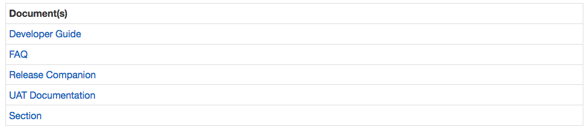

Advanced Features
===========================================

This section is dedicated to View Editor Advanced Features, including
visualizations and custom tags.

Visualizations
----------------------------------------

For TomSawyer diagrams or plots, please see the DocGen Manual.
 
Temporal Diff Tag
-------------------------------------------

Compares an element at two different refs/commits and generates a diff
highlighting what has been added and deleted. You can use the element
history view in the right pane to access element level changes.

Example Code
~~~~~~~~~~~~

:mark:`<mms-diff-attr mms-base-element-id="" (mms-compare-element-id="")
mms-attr="name|doc|val"
   (mms-base-project-id="" mms-compare-project-id="" mms-base-ref-id=""
mms-compare-ref-id=""
    mms-base-commit-id="" mms-compare-commit-id="")></mms-diff-attr>`

Group Documents
-----------------------------------------

The Group Documents directive generates a table used to reference all
the document links within a site. This can be placed on the cover page
of a group.

Here is an example of how you would define the directive to load the
appropriate HTML.

:mark:`<mms-group-docs
mms-group-id="\_18_0_2_bec02f9_1446154915939_541002_41021">[cf:site
docs]</mms-group-docs>`

Here is an example of document links for CAE View Editor site.

Autosave to the browser's localStorage
----------------------------------------------------------------

This feature automatically stores unsaved contents from any of the
CKEditors to the browser’s localStorage except for the editor on the
Comment's Modal, Proposal's Modal, Cross Reference Modal and Workspace's
description. The contents will be auto saved at a configurable interval
of 5 seconds and with the users’ consent reloaded automatically to the
editors which they belong.

These auto saved contents are automatically deleted when either one of
the following conditions is met:

1. Users press on one of the following buttons on the editor itself:

   a. save

   b. save and continue

   c. cancel: when the dialog shows up and users confirm the
      cancellation

   d. delete: when the dialog shows up and users confirm the deletion

2. Users press on one of the following buttons on the toolbar located on
   the right side of the app's layout

   a. save

   b. save and continue

   c. cancel: when the dialog shows up and users confirm the
      cancellation

   d. saveAll: This button is a little bit special because it shows up
      in two different situations.

      i.  Shows up after users click on the "Edit Element" button on the
          toolbar located on the right side of the app's layout. In this
          case, it will delete all the new auto saved contents related
          to the specific element the user is editing.

      ii. Shows up after a user modifies one or more elements on the
          page. In this case, it will delete all the new auto saved
          contents corresponding to all these elements.

When saving to a full capacity browser’s localStorage, all expired auto
saved contents will be automatically deleted to make room for new
contents.

Table Sorting and Filtering
-----------------------------------------------------

There are three main functionalities:

1. Sorting a column

2. Table-Wide filtering

3. Column(s)-Wide filtering

Sorting and Column(s)-Wide Filtering features are enabled only for the
top level table's header columns. Please read further for special rules
of these features regarding different types of content such as an image,
an SVG, and a nested table.

**Sorting Feature works on a single column at a time (no multi-columns
sorting) with the following capabilities and rules:**

1. Sorting is done alphabetically in an ascending or descending order

2. Content such as a nested table, an image and a SVG are not considered
   sortable and as a result, when sorting them among other text-only
   content, they will either be pushed to the bottom or the top based on
   the sorting order

3. To restore the original content's order, click the "Reset Sort"
   button which appears when the order of the content is changed

**Table-Wide filtering works by comparing the user’s specified filter
term against the content of every row on the table with the following
rules:**

1. Images and SVG are not filterable

2. Filter term can either be an exact match or just a partial match of
   the content in the table

**Column(s)-Wide Filtering allows filtering on a column or multiple
columns in a sense that additional filtering can be performed further on
top of the previously filtered results.**    Column(s)-Wide Filtering
works the same way as Table-Wide Filtering regarding the types of
content that can be filtered. Table-Wide and Column(s)-Wide Filtering
don't work on top of each other; when Column(s)-Wide Filtering already
filters some results, Table-Wide Filtering will perform the filtering on
the original content instead of the filtered results and vice versa. To
enable Table-Wide and Column(s)-Wide Filtering features, click the
“Filter table” button.

Configure Org Home Link
-------------------------------------------------

The Org name in the upper left can be configured to go to a specific url
- to change it, issue this POST request to

:mark:`host/alfresco/service/orgs
{"orgs": [
{
"id": "target org id",
"name": "org name",
"homeLink": "some url"
}
]}`

To see current list of orgs, make a GET request to
/alfresco/service/orgs

Configure Auto-numbering
--------------------------------------------------

By default figure and table auto-numbering are sequential. To change the
numbering scheme, fill in the "figureContextDepth" and "figureSeparator"
tag values on the Document stereotype in the model. figureContextDepth
controls how many levels of context to show, figureSeparator is the
separator between context and number.

Ex. 2 and - results in numbering that looks like 1.3-2 or 1.0-3

To suppress MD generated table or figure captions:
~~~~~~~~~~~~~~~~~~~~~~~~~~~~~~~~~~~~~~~~~~~~~~~~~~

In docgen or userscripts, use the "excludeFromList" option to prevent a
generated table or figure from displaying captions and exclude from list
of tables and figures

PDF Customization
-------------------------------------------

When exporting to pdf, the user can choose to provide their own css
stylesheet. If this Advanced Options is used, the header and footer
options from the **Basic Options tab are ignored.**

VE uses PrinceXML for styling PDFs. See Prince User Guide for all
options.

By default, this is the CSS that's used:

:mark:`/\*------------------------------------------------------------------
Custom CSS Table of Contents
1. Images
2. Tables
3. Typography
3.1 Diff
3.2 Errors
4. Figure Captions
5. Table of Contents
6. Page Layout
7. Headers and Footers
8. Signature Box
9. Bookmark Level
------------------------------------------------------------------\*/
/\*------------------------------------------------------------------
1. Images
------------------------------------------------------------------\*/
img {max-width: 100%; page-break-inside: avoid;
page-break-before: auto; page-break-after: auto;
margin-left: auto; margin-right: auto;}
img.image-center {display: block;}
figure img {display: block;}
.pull-right {float: right;}
/\*------------------------------------------------------------------
2. Tables
------------------------------------------------------------------\*/
tr, td, th { page-break-inside: avoid; } thead {display:
table-header-group;}
table {width: 100%; border-collapse: collapse;}
table, th, td {border: 1px solid black; padding: 4px; font-size: 10pt;}
table[border='0'], table[border='0'] th, table[border='0'] td {border:
0px;}
table, th > p, td > p {margin: 0px; padding: 0px;}
table, th > div > p, td > div > p {margin: 0px; padding: 0px;}
table mms-transclude-doc p {margin: 0 0 5px;}
th {background-color: #f2f3f2;}
/\*------------------------------------------------------------------
3. Typography
------------------------------------------------------------------\*/
h1, h2, h3, h4, h5, h6 {font-family: 'Arial', sans-serif; margin: 10px
0;
page-break-inside: avoid; page-break-after: avoid;}
h1 {font-size: 18pt;} h2 {font-size: 16pt;} h3 {font-size: 14pt;}
h4 {font-size: 13pt;} h5 {font-size: 12pt;} h6 {font-size: 11pt;}
.ng-hide {display: none;}
.chapter h1.view-title {font-size: 20pt; }
body {font-size: 10pt; font-family: 'Times New Roman', Times, serif; }
/\*------------------------------------------------------------------
3.1 Diff
------------------------------------------------------------------\*/
ins, .ins {color: black; background: #dafde0;}
del, .del{color: black;background: #ffe3e3;text-decoration:
line-through;}
.match,.textdiff span {color: gray;}
.patcher-replaceIn, .patcher-attribute-replace-in, .patcher-insert,
.patcher-text-insertion
{background-color: #dafde0;}
.patcher-replaceIn, .patcher-attribute-replace-in, .patcher-insert
{border: 2px dashed #abffb9;}
.patcher-replaceOut, .patcher-delete, .patcher-attribute-replace-out,
.patcher-text-deletion
{background-color: #ffe3e3; text-decoration: line-through;}
.patcher-replaceOut, .patcher-delete, .patcher-attribute-replace-out
{border: 2px dashed #ffb6b6;}
.patcher-text-insertion, .patcher-text-deletion {display: inline
!important;}
[class*=\\"patcher-\\"]:not(td):not(tr) {display: inline-block;}
/\*------------------------------------------------------------------
3.2 Errors
------------------------------------------------------------------\*/
.mms-error {background: repeating-linear-gradient(45deg,#fff,#fff
10px,#fff2e4 10px,#fff2e4 20px);}
/\*------------------------------------------------------------------
4. Figure Captions
------------------------------------------------------------------\*/
caption, figcaption, .mms-equation-caption {text-align: center;
font-weight: bold;}
table, figure {margin-bottom: 10px;}
.mms-equation-caption {float: right;}
mms-view-equation, mms-view-figure, mms-view-image {page-break-inside:
avoid;}
/\*------------------------------------------------------------------
5. Table of Contents
------------------------------------------------------------------\*/
.toc, .tof, .tot {page-break-after:always;}
.toc {page-break-before: always;}
.toc a, .tof a, .tot a { text-decoration:none; color: #000;
font-size:9pt; }
.toc .header, .tof .header, .tot .header { margin-bottom: 4px;
font-weight: bold;
font-size:24px; }
.toc ul, .tof ul, .tot ul {list-style-type:none; margin: 0; }
.tof ul, .tot ul {padding-left:0;}
.toc ul {padding-left:4em;}
.toc > ul {padding-left:0;}
.toc li > a[href]::after {content: leader('.')
target-counter(attr(href), page);}
.tot li > a[href]::after {content: leader('.')
target-counter(attr(href), page);}
.tof li > a[href]::after {content: leader('.')
target-counter(attr(href), page);}
/\*------------------------------------------------------------------
6. Page Layout
------------------------------------------------------------------\*/
@page {margin: 0.5in;}
@page landscape {size: 11in 8.5in;}
.landscape {page: landscape;}
.chapter {page-break-before: always}
p, div {widows: 2; orphans: 2;}
/\*------------------------------------------------------------------
7. Headers and Footers
------------------------------------------------------------------\*/
@page:first {@top {content: ''} @bottom {content: ''} @top-left
{content: ''}
@top-right {content: ''} @bottom-left {content: ''} @bottom-right
{content: ''}}
/\*------------------------------------------------------------------
8. Signature Box
------------------------------------------------------------------\*/
.signature-box td.signature-name-styling {width: 60%;}
.signature-box td.signature-space-styling {width: 1%;}
.signature-box td.signature-date-styling {width: 39%;}
/\*------------------------------------------------------------------
9. Bookmark Level
------------------------------------------------------------------\*/
.h1 {bookmark-level: 1;}
.h2 {bookmark-level: 2;}
.h3 {bookmark-level: 3;}
.h4 {bookmark-level: 4;}
.h5 {bookmark-level: 5;}
.h6 {bookmark-level: 6;}
.h7 {bookmark-level: 7;}
.h8 {bookmark-level: 8;}
.h9 {bookmark-level: 9;}`

For page related css, see Paged Media
~~~~~~~~~~~~~~~~~~~~~~~~~~~~~~~~~~~~~

VE css classes
~~~~~~~~~~~~~~

Available Classes

+------------+---------------------------------------------------------+
| selector   | description                                             |
+============+=========================================================+
| .ve-       | container of the document cover page                    |
| cover-page |                                                         |
+------------+---------------------------------------------------------+
| .chapter   | top level views (1, 2, 3, etc)                          |
+------------+---------------------------------------------------------+
| .fir       | first view                                              |
| st-chapter |                                                         |
+------------+---------------------------------------------------------+
| .h1, .h2,  | corresponds to view or section titles at that level     |
| .h3, etc   | (title of view/section 1.2.3 would have class of .h3)   |
+------------+---------------------------------------------------------+
| .v         | the h1 title of a view or section                       |
| iew-title, |                                                         |
| .sec       |                                                         |
| tion-title |                                                         |
+------------+---------------------------------------------------------+
| .toc       | table of contents                                       |
+------------+---------------------------------------------------------+
| .tof       | list of figures, list of equations                      |
+------------+---------------------------------------------------------+
| .tot       | list of tables                                          |
+------------+---------------------------------------------------------+
| .landscape | landscape elements                                      |
+------------+---------------------------------------------------------+

Example customizations
~~~~~~~~~~~~~~~~~~~~~~

For adding footer/headers
^^^^^^^^^^^^^^^^^^^^^^^^^

:mark:`@page{ @bottom-left {font-size: 9px; content: 'footer';}
@bottom-right {font-size: 9px; content: counter(page);}}`

Change font size of titles based on level:
^^^^^^^^^^^^^^^^^^^^^^^^^^^^^^^^^^^^^^^^^^

:mark:`//smaller sizes for nested titles
.h1 {font-size: 18pt;} .h2 {font-size: 14pt;} .h3 {font-size: 12pt;}
.h4 {font-size: 10pt;} .h5, .h6, .h7, .h8, .h9 {font-size: 9pt;}
//start top level sections on odd pages
.chapter {page-break-before: right;}`

Starting page number on a certain page:
^^^^^^^^^^^^^^^^^^^^^^^^^^^^^^^^^^^^^^^

:mark:`//start toc on odd page, set page number to 5, give it page style
toc
.toc {page-break-before: right; counter-reset: page 5;}
.toc, .tof, .tot {page-break-after:always; page: toc;}`

Using Roman numerals:
^^^^^^^^^^^^^^^^^^^^^

:mark:`//alternating footers and roman numeral page number for toc pages
@page toc:right { @bottom-left {font-size: 9px; content: 'footer';}
@bottom-right {font-size: 9px; content: counter(page, lower-roman);}}
@page toc:left { @bottom-right {font-size: 9px; content: 'footer';}
@bottom-left {font-size: 9px; content: counter(page, lower-roman);}}`

Alternating footers based on odd/even pages:
^^^^^^^^^^^^^^^^^^^^^^^^^^^^^^^^^^^^^^^^^^^^

:mark:`//start main content at page 3, alternating numbers
.first-chapter {counter-reset: page 3;}
@page:right { @bottom-left {font-size: 9px; content: 'footer';}
@bottom-right {font-size: 9px; content: counter(page);}}
@page:left { @bottom-right {font-size: 9px; content: 'footer';}
@bottom-left {font-size: 9px; content: counter(page);}}`

Advanced Cf
-------------------------------------

A cross reference can also specify another branch or time, ex.

<mms-cf mms-element-id="elementId" mms-ref-id="refid"
mms-commit-id="commit id" mms-project-id="projectid"
mms-cf-type="name"></mms-cf>

refId, commitId, and projectId are optional and not included when adding
cf via the UI. If they're not included, they inherit the parent
element's, then 'master' for refId and 'latest' for commitId.

The attributes can be added manually via the text editor's html editing
tab if desired.

View Editor User Guide: 10 Run XLR
----------------------------------

There's a custom tag one can add to trigger an XLR release from any
view.

To add the button, go into source mode of a text field and add the
following:

<run-xlr template-id="{templateId}" xlr-task-name="Run XLR"
xlr-release-name="release name">ignore</run-xlr>

Where the template-id is the string in the url for the xlr design
template, with '/' instead of '-'.

Ex, if the url in xlr for your template is this:

https://cae-xlrelease.jpl.nasa.gov/#/templates/Folder898892011-Folder521642095-Folder47c1077774ae4cf69d499daa260b3904-Release619d801931384eae9a25ba8baff2,

the template-id would be

Folder898892011/Folder521642095/Folder47c1077774ae4cf69d499daa260b3904/Release619d801931384eae9a25ba8baff2

The xlr-task-name attribute is just the name of the button that will
display.

The xlr-release-name is what the release will be called in xlr.

Once a user clicks the button, a login popup will appear, this is for
logging into xlrelease using jpl username/pass and permission to create
a release based on the template is controlled by xlr.

Currently will send the following as variables in the release:

"contentEditor": jpl username

"editorEmail": jpl email