.. include:: images.rst

############################
Groups, Documents and Views
############################

The following documentations provide instructions on what View Editor
"Group", "Document" and "Views" are and how to use them.

Groups
================================

|groups| **Groups** organize documents and other groups within a project

Create Group
--------------------------------------

Since "Group" can only be used to organize documents/groups, it can only
be created under the project level.

#. Select a parent group to create your group under in the tree or
   create group at the root level by navigating to the project "home"

#. Select the plus in the left pane

   .. image:: media/image63.png
        :width: 4.47245in
        :height: 1.40285in

#. Enter a title for the new group

   .. image:: media/image64.png
    :width: 5.90069in
    :height: 2.16981in

#. Your group will appear in the tree

   .. image:: media/image65.png
      :width: 4.48634in
      :height: 1.48619in

Delete Group
--------------------------------------

Only an empty "Group" can be deleted. To delete "Super Classified Group"
Group in the picture above, 

#. Select the group

   .. image:: media/image66.png
      :width: 4.50023in
      :height: 1.79176in

#. Click delete and confirm the deletion

   .. image:: media/image67.png
      :width: 5.90069in
      :height: 1.67038in

#. Your group will no longer appear in the tree

   .. image:: media/image68.png
      :width: 4.63913in
      :height: 1.44452in

Follow the same steps to delete "Super Classified Group".

Organize Groups/Documents
---------------------------------------------------

"Groups" can be used to group together documents/groups. To move
documents into a group:

#. Select the "Move to/from Group" Icon in the left pane

   .. image:: media/image69.png
      :width: 4.48634in
      :height: 1.0695in

#. The project tree will appear in the center pane

   .. image:: media/image70.png
      :width: 5.90069in
      :height: 3.18406in

#. Drag any documents or group and drop it under another "Group" and
   then click save. *Groups and documents at the same level are ordered
   alphabetically and cannot be manually ordered.*

   .. image:: media/image71.png
      :width: 5.90069in
      :height: 0.35271in

#. Your updated ordering will appear in the tree

   **\**Note: Ordering is not maintained when moving groups(s) or
   document(s) in or out of another group. The ordering is automatically
   generated with two rules: "Group" shows up before "Document" and both of
   them are placed in ascending order alphabetically relative to its
   peer.**

Documents
===================================

A **Document** is composed of Views (see `Add
Views <#add-a-new-view>`__), presentation
elements (see `Add Presentation Elements to
View <#add-presentation-elements>`__), model
elements, etc.

To see how a user can sync the new document to MMS, refer to Update from
MMS.

Create Document
----------------

#. In the upper right go to the project home  |image37|

   Or to create document as a child of a group, select the group.

#. Select the plus in the left pane and "Add Document"

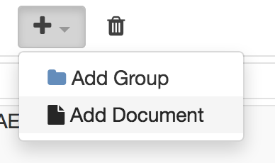

#. In the Create Document Dialogue, add a name, and select "create"
button.

Delete Document
----------------

#. Select the document you wish to delete in the tree

#. Click on the trash button |image38|

    Note that deleting a view on View Editor will **neither** delete the View from the model nor from MMS.
    To delete a view permanently, delete it from the model **and** then commit that delete to MMS.

Structure/Edit Document
------------------------

#. Build high level document structure by creating
`Views <#views>`__

#. To edit content, toggle edit mode in the upper right
toolbar\ |image39|

#. Add text, images, tables, equations, and section Presentation
Elements (PEs, see `Add Presentation
Elements <#add-presentation-elements>`__\ )
using the plus menu |image40| to the left of the document content. The
advantage of using image, table, and equations PEs is that they:

-  can be cross referenced and auto-numbered (see `Use Cross
   References <#use-cross-references>`__)

-  appear in the exported document table of contents

-  appear in the left document navigation tree

Views
======

| Views are sections of a document that can hold pictures, diagrams, or
  textual information to describe ideas and objects.
|  

Views can be added to a document in three different ways:

1. Adding a new View

2. Adding a new View as a subview

3. Adding an existing View

Add a New View
---------------

Select the document (the root on the left pane). Click on the Add
button  :

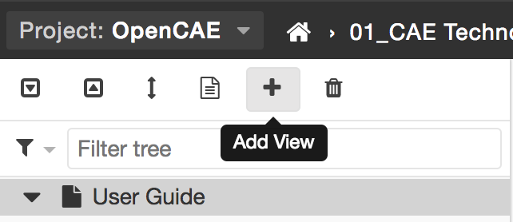

Type in a name, and click on the "CREATE" button.

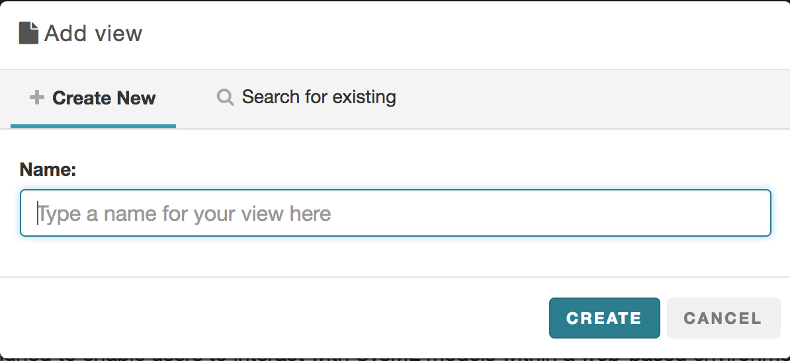

Add a New View as a Subview
-----------------------------

Select the view under which you want to nest the subview and follow the
same steps above:

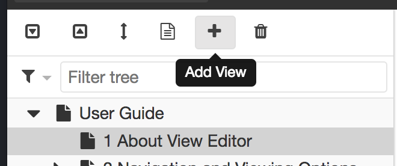

Add an Existing View
---------------------

To add an existing view to another document, select a document or view
to which you want to nest the existing view under, and click on the Add
button .

On the pop-up dialogue, click on the "search for existing" tab:

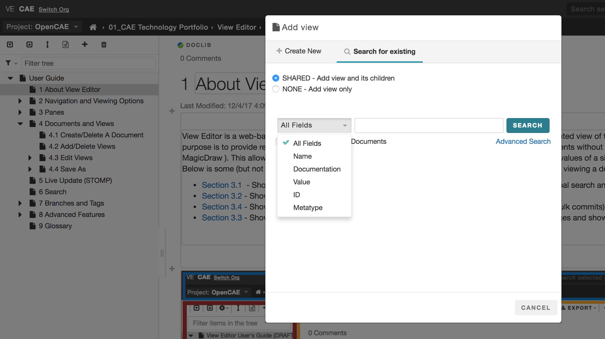

Select "SHARED" if you want to show the view/document and its
children. Select "NONE" if you want to show only the view/document.

Select the desired search constraints: ALL, NAME, DOCUMENTATION, VALUE,
or  ID.

Select the returned view element. Click on the returned hyper link.

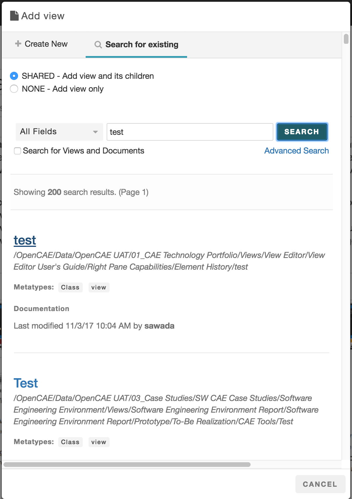

The existing view has been embedded under another view:

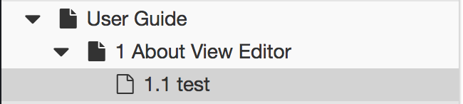

You can edit this view object from the view that was just nested or from
the original view. The *single source of truth* principle is maintained.

Note: The original view will NOT be deleted upon the deletion of this
view.

Delete View
-------------------------------------

A user can delete any existing view by selecting the view on the left
pane, and clicking on the Delete button   from a document.

Note that deleting a view on View Editor will **neither** delete the
View from the model **nor** from MMS.

To delete a view permanently, delete it from the model **and** then
commit that delete to MMS.

Upon deletion, the browser redirects the user to the top of the
document.

Edit Views
------------------------------------

This section focuses on the **editing aspects** that View Editor offers
including the following capabilities:

-  High level document editing

-  Full text editing

-  Adding special elements (images, videos, links, etc)

-  Specifying element properties

-  Using cross references for "source of truth" accuracy

For more information regarding Presentation Elements as they appear in
the MagicDraw model, please consult the Presentation Element Instances
view.

Add Presentation Elements
^^^^^^^^^^^^^^^^^^^^^^^^^

**Presentation elements (PE)** are key components in the interaction
between View Editor and the system model. They can be thought of as
small, labeled containers that hold the information displayed in Views.

View Links allow you to cross reference an existing PE inside another
PE. See the section, `View
Link <#cross-reference-as-link>`__, for more
detail.

 The following demonstrates how to add and use various kinds of
presentation elements to edit View content.

Adding Text
"""""""""""

    The default PE for new Documents/Views is the text box. This will
add a paragraph PE.

1. Enable edit mode if not yet active

2. Click  on |image41|

3. Name it (optional)

4. Click on\ |image42|  to add content

Adding Section
""""""""""""""

Sections are used for adding concrete organization to views. They are
similar to views in the sense that they provide a specific amount of
information. They are also containers for presentation elements, and can
be cross referenced.

1. Enable edit mode if not yet active

2. Click  on |image43|

3. Name it (optional)

4. Click new section area to add content |image44|

5. You can nest other PEs to the section PE.

Adding  Comment
"""""""""""""""

You can insert comments to all documents and views. Comments are saved
in the model and are by default hidden from the view. See `Show
Comments/Elements <#show-commentselements>`__
for more information.

Adding Table
""""""""""""

You can add a table PE. Adding a separate table PE adds an element of
organization (my naming and separating it from text) to the content. It
also lets you cross reference the content directly.

1. Enable edit mode if not yet active

2. Click  on |image45|

3. Name it (optional)

4. Click on  |image46| to add content

Adding Figure and Videos
""""""""""""""""""""""""

A user can add figures, such as images or videos, in an image PE.

1. Enable edit mode if not yet active

2. Click  on |image47|

3. Name it (optional)

4. Click on |image48| to add content

 

Adding Equation
"""""""""""""""

A user can add an equation PE.

1. Enable edit mode if not yet active

2. Click  on |image49|

3. Name it (optional)

4. Click on |image50| to add content 

Cross Reference as Link
"""""""""""""""""""""""""""""""""""""""""""""""""

A Cross Reference as Link can be inserted to your view to reference an
existing view or presentation element.

Steps:

 Click |image51| on |image52|

** or**

 |image53|

Search for the desired PE/View/Section and click on the element name or
related document to insert a cross reference as a link

**For PE numbering **

Search for the desired PE and click on the element name 

Note: To update the link text you must switch to source view and update
the <mms-view-link> tag by adding the **'link-text'** attribute as
shown:

<mms-view-link **link-text="new name for link"**  mms-doc-id="sampleID"
mms-element-id="sampleID">[cf:SampleElement.vlink]</mms-view-link>

Edit A Presentation Element
^^^^^^^^^^^^^^^^^^^^^^^^^^^^^^^^^^^^^^^^^^^^^^^^^^^^^

The following operations can be performed on views and documents:

-  Edit **Style** - stylize text in a similar fashion to Microsoft Word.

-  Add/edit **Links**

-  **Find and Replace** - search, find, and replace a PE

-  Edit HTML **source code **- edit the PE by modifying the HTML source
   code directly

Save Elements
^^^^^^^^^^^^^^^^^^^^^^^^^^^^^^^^^^^^^^^

| There are several saving options when editing Presentation Elements
  (PEs).
| To learn how to save Documents and Views as PDFs, Word Documents etc.,
  refer to `Save As <#save-as>`__.

**Saving elements:**

-  Preivew Changes

-  Save (and Close)

-  Save and Continue

-  Auto Save ( See `Autosave to the browser's
   localStorage <#autosave-to-the-browsers-localstorage>`__
   )

-  Cancel

**Note:** When canceling, if changes have been made, the following
message will appear to warn the user that canceling changes will mean
that changes will not be saved. The user would need to "Cancel" out of
this message and manually save the PE if the changes were desired.

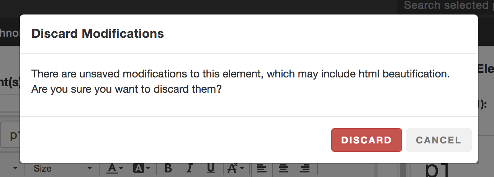

Use Cross References
^^^^^^^^^^^^^^^^^^^^^^^^^^^^^^^^^^^^^^^^^^^^^^

**Cross References** are pointers to other sources of information,
typically text or documentation. Such references can be **names**,
**documentation**, or **values** of model elements, as well as other
**views** and **documents**. The primary benefit of cross references is
that wherever they are accessed in a Document/View, the Document/View
will be automatically updated when the element is modified. This is also
the direct interface for changing model elements because any change to
the element cross reference will be reflected in the model itself. As
you will notice throughout both this guide and Model Development Kit
User's Guide , there are cross references constantly being made to other
views and documents.

The following guide demonstrates the different features and capabilities
for cross referencing in View Editor.

 

Create a Cross Reference - name, documentation, and value
"""""""""""""""""""""""""""""""""""""""""""""""""""""""""

-  From 2.4.0 on, there is a checkbox in the cross reference popup that
   allows you to restrict the **editability** of the cross referenced
   element where you inserted it. This will only affect editing in the
   center pane and not in the element specification on the right pane.

Search and add Cross Reference through interface
""""""""""""""""""""""""""""""""""""""""""""""""

1. Enable Edits |image54|

2. Select a Presentation Element to Edit

3. Click on |image55|\ on the editor tool bar.

4. You can search for the existing element by the following fields:

   a. Name

   b. Documentation

   c. Value ( & Name of a different element in this case)  

   d. Element ID

5. Select the element you want to cross reference.

6. Click on the item that you want to cross reference 

7. You will see a blue box with the label, *cf: xxxxx*, where *xxxxx* is
   the name of the cross referenced object.

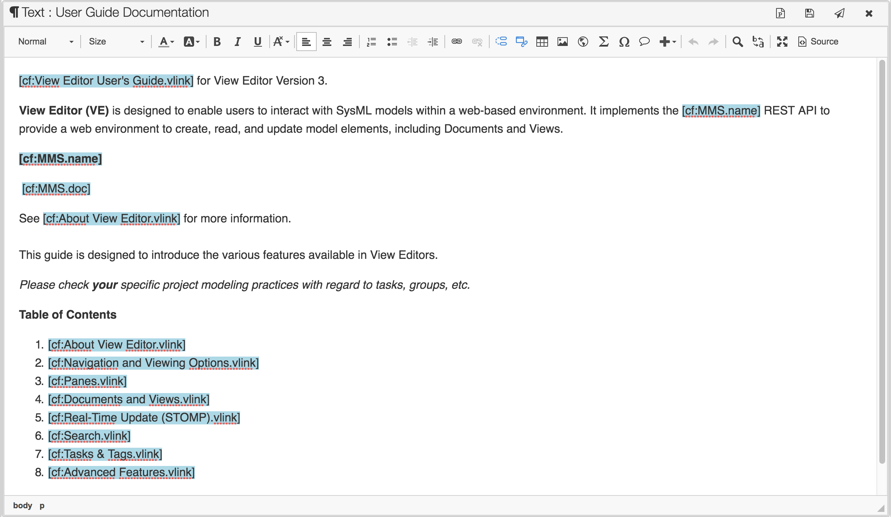

 

Find Cross Reference inline 
""""""""""""""""""""""""""""

1. Enable Edits |image56|

2. Select a Presentation Element to Edit

3. You can use the '@' symbol to find cross references inline

4. Can use the up/down arrow to highlight and select element

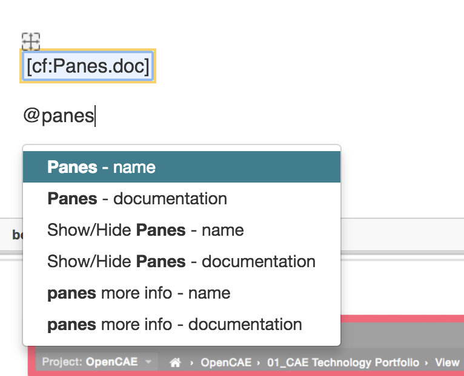

**Editing cross referenced elements**

1. Cross referenced element can come from:

   -  Different part in View Editor

   -  New Cross Reference

2. Bonus: Run “Update from MMS” in MagicDraw to see the changes to the
   elements

   -  More information can be found in the description

To learn more about how the edited elements are synced back into the
Model, see Update from MMS.

Reorder Views/Elements
^^^^^^^^^^^^^^^^^^^^^^^^^^^^^^^^^^^^^^^^^^^^^^^^

You can reorder Views and Presentation Elements (PEs) to change the
hierarchy of the elements.

Reorder Views (Enhanced)
""""""""""""""""""""""""

1. Click on the **"Reorder Views" button** on the **left pane**.

2. .. image:: media/image97.png
      :width: 4.52801in
      :height: 1.15284in

3. Drag and drop the tile to reorder views as desired.

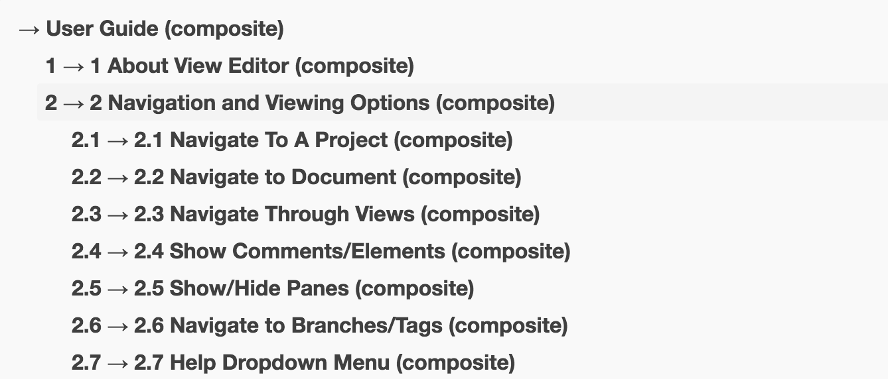

Note: The blue position guide arrows let you know where the
view/document will be inserted as you drag a tile:

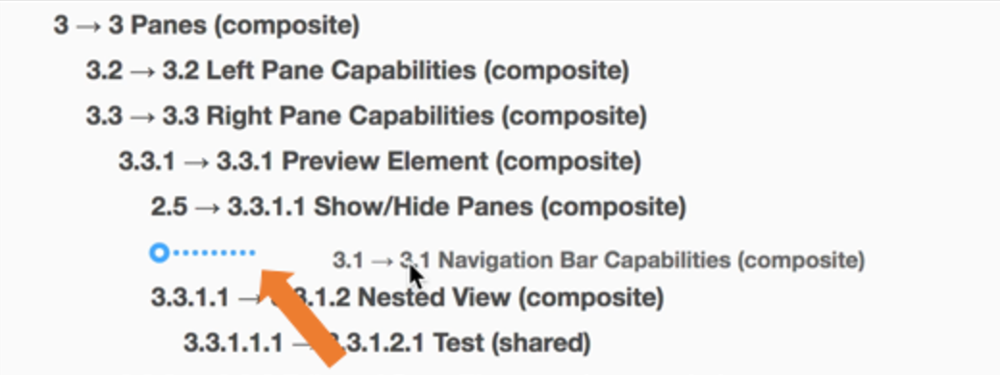

Note: When a view that has subviews is selected to be moved, all of its
subviews will move with it.

To learn about adding different types of views, refer to [cf:Add
Views.vlink] 

   **Capabilities**:

-  Switch 2 views

-  Move a view to become a subview

-  Move a view to become a parent of another

-  Change node level (depth)

**Notes for Modelers/Developers:**

Each view will have indication of which type of connection it's under
(composite/shared/none), only composite/shared views will show their
child views. Hence you cannot move views under a view that's connected
as "none"

Known issue -Section numbering has been added since version 3.2.2, but
view reordering page still showing numbers as if sections aren't
numbered. We are working on a more robust reordering option.

Reorder Presentation Elements (PEs)
"""""""""""""""""""""""""""""""""""

**1. Click on the "Reorder Content" button on the right pane.**

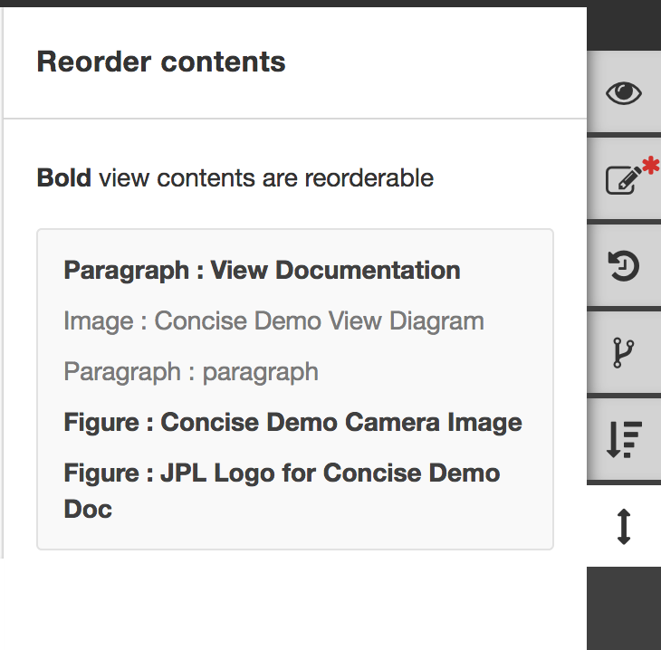

**2. Drag and drop the tile to move the elements around and reorder them
as desired.**

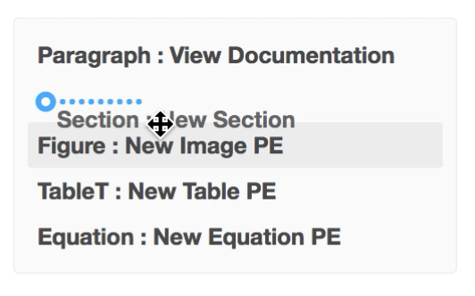

For more information on PEs, refer to `Add Presentation
Elements <#add-presentation-elements>`__

For more information of other tools in the Right Pane, refer to `Right
Pane Capabilities <#right-pane-capabilities>`__

Save As
---------------------------------

You can save Documents and Views locally. The following guides
demonstrate the options for saving Views and Documents.

Save As options include the following for both Documents and Views:

-  `Print to Printer <#print-to-printer>`__

-  `Generate PDF <#generate-pdf>`__

-  `Save as Word
   Document <#save-to-word-document>`__

-  `Export Tables <#export-tables>`__

Print to Printer and Save to PDF or Word will also generate the table of
contents, list of tables, list of figures, and update the numbering
within the document for any links. The popup will also allow you to
enter custom header and footer info, with prefilled info if it's
available in the model (through the Document stereotype's docMetadata
tags).

Print to Printer
^^^^^^^^^^^^^^^^^^^^^^^^^^^^^^^^^^^^^^^^^^

-  **Print View**

   a. You can physically print a selected view:

   b. 

      i.   Select the view/document you want to print out (click on
           "Full Document"|image57|\ if you wish to print out the entire
           document).

      ii.  Click "Print"|image58|\ |image59|

      iii. The print content dialogue will pop up       

      iv.  Select a printer and print 

Generate PDF
^^^^^^^^^^^^^^^^^^^^^^^^^^^^^^^^^^^^^^

See these subsections for more information about specific generations:

1. `Generate PDF of
   Document <#generate-pdf-of-viewdocument>`__

2. `Generate PDF with Model Based
   Cover <#generate-pdf-with-model-based-cover-page>`__

3. `PDF Customization <#pdf-customization>`__

Generate PDF of View/Document
"""""""""""""""""""""""""""""""""""""""""""""""""""""""

**Save View as PDF **\ |image60|

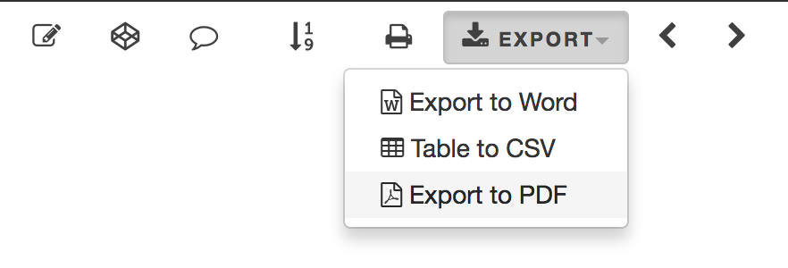

You can convert the document/view to a PDF file and save.

Step By Step Instructions:
                          

-  Select the view you want to convert

-  Click " Export " button

-  Select " Export to PDF "

-  If not in " Full View " mode, a dialogue window will pops up, asking
   if you want to export from Full View.

-  Generate PDF Document dialogue will pop up:

   -  Choose whether or not to create list of tables and figures

      -  If you wish to generate list of tables and figures based on the
         presentation element type, check\ * Use HTML for List of Tables
         and Figures (will not include equations and may differ from web
         numbering) *\ option

   -  Check landscape option if necessary

-  Click on " Generate PDF "

             |image61|       

-  You will receive an email with the link to the document/view,
   converted PDF

                |image62|

         Follow the link in the email message to view the PDF document,
stored in Alfresco. To download, click on the Download button. To view
in the browser, click on the "View In Browser".

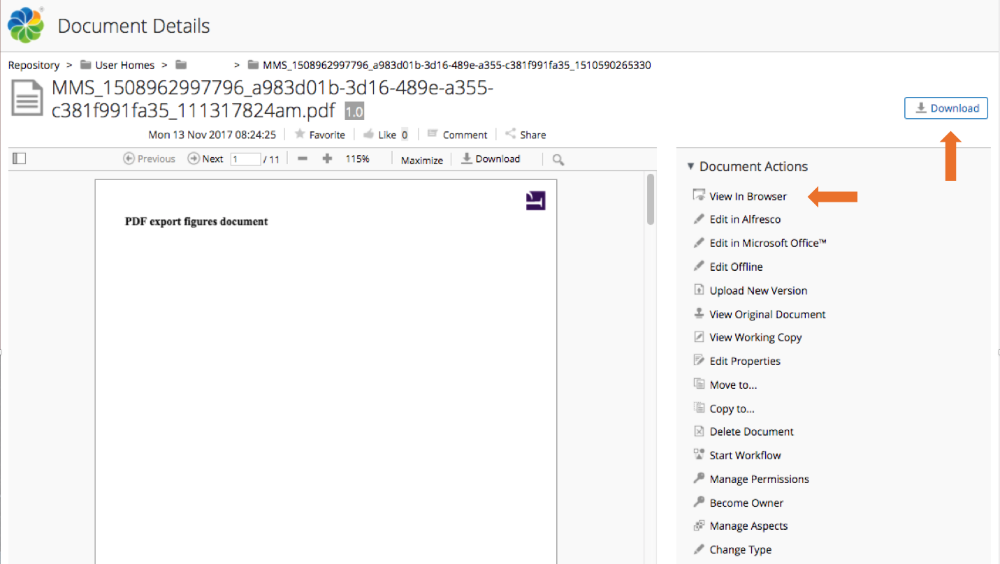

Options provided in “GENERATE PDF DOCUMENT” Dialogue Window
                                                           

1. *Generate List of Tables and Figures*: 

    Check the box if you wish to generate a list of tables and figures
beneath the Table of Contents.

2. *Use HTML for List of Tables and Figures (will not include equations
and may differ from web numbering)*:

    Choose this option if you wish to generate the list of tables and
figures from all existing tables and figures in documents/views.

    Leave the box unchecked If you wish to generate the lists based on
the associated presentation elements

    Note: Images in <figure> tags are used to generate the list.
                                                                

Generate PDF with Model Based Cover Page
""""""""""""""""""""""""""""""""""""""""""""""""""""""""""""""""""

In certain circumstances, you may want to create a custom cover page for
a chosen document. The cover page is identified as the first View and
has the Metatype of "Document" (highlighted below on the right pane).
See below for the cover page of this User Guide:

This can be done in two ways:

1. View Editor

   a. A user would edit the cover page exactly the same way as any other
      view in the document.

   b. A user can add Presentation Elements (including texts, pictures,
      etc.) and edit through normal ways.

   c. This is ideal for customizing one document at a time.

2. MagicDraw

   a. A user can add a normal ViewPoint to any cover page, the same way
      a user would do for any view.

   b. All normal ViewPoint methods are available for the Cover Page as
      well.

   c. This is ideal for creating a reusable cover pages.

   d. See Create a Reusable Cover Page more information.

Save to Word Document
^^^^^^^^^^^^^^^^^^^^^^^^^^^^^^^^^^^^^^^^^^^^^^^

**Save Document/View To Word**\ |image63|

-  You can convert the document/view to a Word file and save.

.. _step-by-step-instructions-1:

Step-by-step instructions: 
"""""""""""""""""""""""""""

1. Click on " *Export* " button, and select "*Export to Word*" (See
   below)

2. If not in " Full View " mode, a dialogue window will pops up, asking
   if you want to export from Full View.

3. You will receive an email with the link to the converted
   Word document/view.

Export Tables
^^^^^^^^^^^^^^^^^^^^^^^^^^^^^^^^^^^^^^^

Tables to CSV
""""""""""""'

            |image64|

-  Click on " Export " button, and select " Table to CSV "

-  You will see the following prompt:

        |image65|

-  Click on Export To CSV. The popup window below will display.

        |image66|

-  Click on " Save to CSV " button to store the table in a view/document
   as a CSV file.

Save all tables from document to CSV
""""""""""""""""""""""""""""""""""""

-  Go to the full document by clicking on |image67|\ button.

-  Follow the steps above.

**Export Rapid Table**

1. Filter and export options are available when tables ("rapid tables")
   are generated through MagicDraw. In the following clip, the user
   began with an existing rapid table ("Community Resources" on
   MagicDraw and demonstrates how to filter the contents and export the
   full table as CSV.                                                  
         |image68|

2. Learn how to create a Rapid Table in a view here: Create and Generate
   a Rapid Table

3. The Filter and Export icons appear (see the orange arrow in the image
   above):

4. You can also export a filtered table by following the same steps but
   *not* "Reset" filter

**To Filter Table**

1. Click “Filter Table” button

2. Enter desired filter and “Apply”

3. "Reset" filter

**To Export CSV** (\*can be cross referenced to"Save as" screencast )

1.    Click “Export CSV” button

2.    Open with default settings