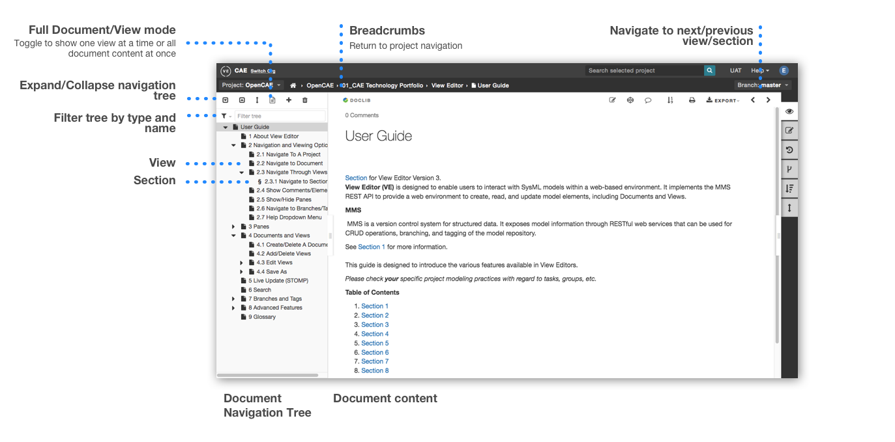
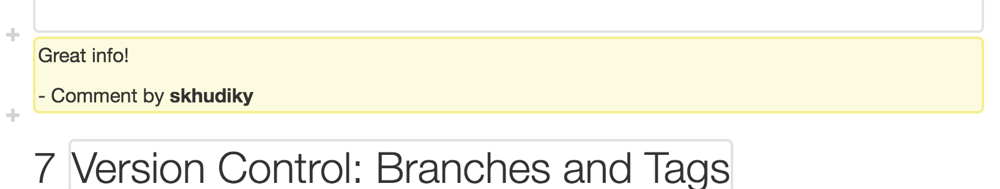
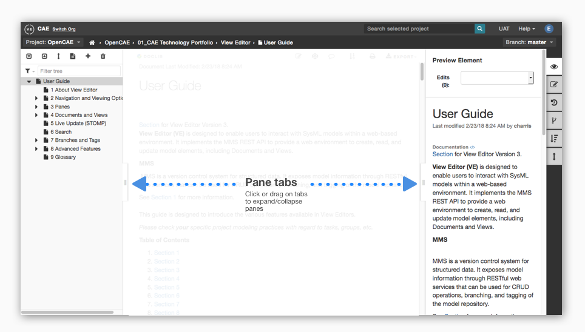
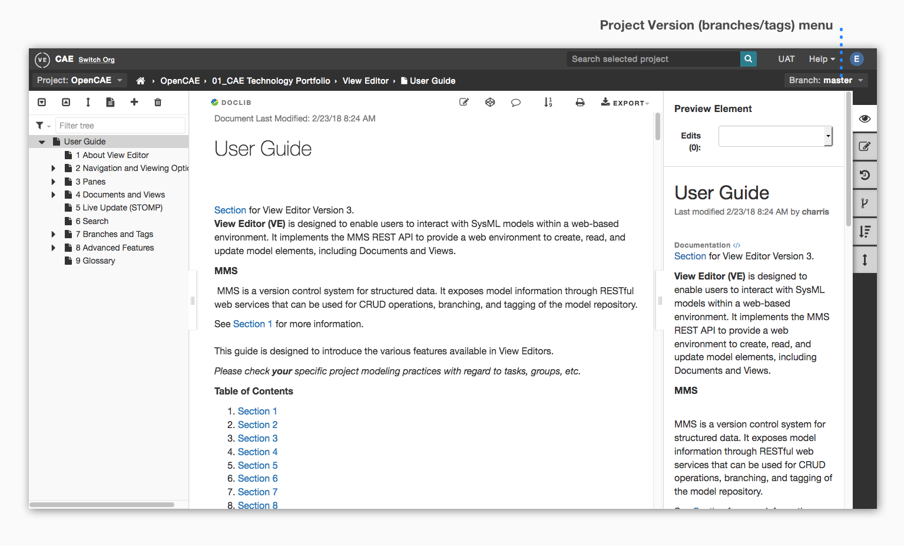
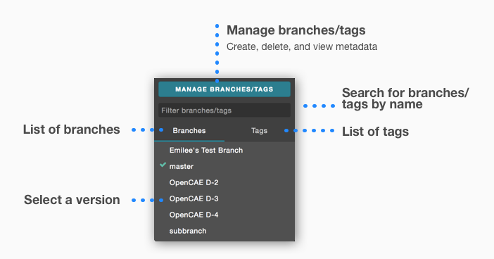
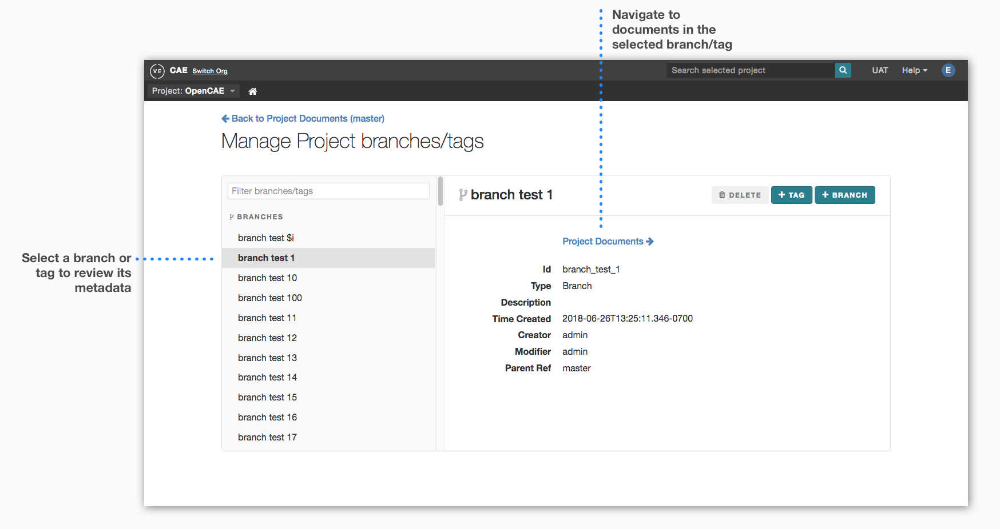
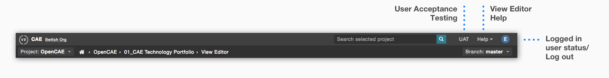

.. include:: images.rst

***********************
Navigation and Viewing
***********************

View Editor offers many ways to interact with model elements. The
following subviews are provided to demonstrate various interactive
capabilities.

Navigate To A Project
======================

**Orgs** are a configuration-managed collection of projects.

**Projects** are collections of Documents and Views and their related
elements. They correspond to SysML models.

#. Login using MMS credentials

   .. image:: media/image2.png
   :width: 5.9007in
   :height: 4.20666in

#. Choose Org. and Project

    **Orgs** are a configuration-managed collection of projects.
    
    **Projects** are collections of Documents and Views and their related
    elements. They correspond to SysML models.
    
   .. image:: media/image3.png
      :width: 5.9007in
      :height: 4.20666in

#. You are now in your selected project

    -  You can still switch projects from the dropdown or switch org from
       the top navigation bar
    
    -  Click arrow to expand the directory to view documents that exists on
       the currently selected project:
    
    -  Groups are specified by a folder icon and used for document
       organization in View Editor.

Navigate To A Document
======================

#. To return back to project navigation, use the document breadcrumbs:

   .. image:: media/image4.png
      :width: 5.90069in
      :height: 0.77519in
      
   Documents are the key to interacting with the system model. More
   information can be found in `Creating Documents <#create-document>`__

#. If you are not already in the correct project, in the upper left, navigate to the project that contains the document.

   .. image:: media/image5.png
      :width: 5.03125in
      :height: 2.34375in
   

#. Select your document in the left pane. You can filter and expand
   the tree to find it.

   .. image:: media/image6.png
      :width: 5.90069in
      :height: 3.52893in

#. This opens the document's cover page, which describes the
   contents of the document

#. Click on the document title or "Open Document" button on the center
   pane. Alternatively, double click on the document in the left pane

   .. image:: media/image7.png
      :width: 5.90069in
      :height: 3.75705in

#. To return back to project navigation, use the document
   breadcrumbs:

   .. image:: media/image8.png
      :width: 5.90069in
      :height: 0.77905in

Documents are the key to interacting with the system model. More
information can be found at: `Create New
Document <#create-document>`__.

Navigate Within A Document
----------------------------------------------------

 

Navigate in the Left Pane
~~~~~~~~~~~~~~~~~~~~~~~~~

-  |image1|\ \ **Views** are individual parts of a document. They can be
   specialized to have their own content and layout.

-  **§ Sections** are subsections of Views. They are similar to views in
   the sense that they provide a specific amount of information, contain
   presentation elements, and can be cross referenced.

-  To filter by type and display **tables** , **images**, and
   **equations** in the tree, use the **tree filter** |image2|

View Modes
~~~~~~~~~~

Toggle |image3|\ **Full document/View mode** in the upper left

-  In **View mode**, one view and its sections are shown at a time

   -  Use the **arrows in the upper right tool bar**\ |image4| to
      navigate through views and sections.

-  In **Full Document mode**, the entire contents of a document are
   shown at once

For more information on adding, editing, and saving views, refer to
`Documents and
Views <#groups-documents-and-views>`__.

For more information on Sections, see `Add Presentation
Elements <#add-presentation-elements>`__.

Show Comments/Elements
------------------------------------------------

Comments:
~~~~~~~~~

View Editor Comments are *hidden* by default.

 

Example:
~~~~~~~~

1 Comment, Last Commented 2/21/16 11:55 AM by mpiette

| Click the dialog balloon,\ |image5| to display comments
| ( see\ |image6| on top right)

The comments will appear as follows:

| These comments are stored in the model as documentation of the view
  itself.
| To **hide the comments**, click the dialog balloon again.

(See `Add Presentation
Elements <#add-presentation-elements>`__ for
creating a comment, a type of presentation element.)

**Elements:**

| Click on the "Show Elements" icon |image7| to display outlines of all
  presentation components.
| See `Right Pane
  Capabilities <#right-pane-capabilities>`__
  for more information.

Show/Hide Panes
-----------------------------------------

 

Show/hide the Left and Right panes by clicking or dragging the **pane
tab**\ |image8|

For more information about the Left Pane, refer to `Left Pane
Capabilities <#left-pane-capabilities>`__.

For more information about the Right Pane, refer to  `Right Pane
Capabilities <#right-pane-capabilities>`__.

Branch/Tag (Version) Navigation
---------------------------------------------------------

Use Branches/Tags menu to navigate to different versions of the selected
project. More information can be found in `Tasks &
Tags <#version-control-branches-and-tags>`__.

#. Go to the dropdown labeled "Branch" or "Tag" in the upper right**

#. Select a branch or tag in the menu.** This will load that version
of your selected project

To navigate to the Branches/Tags manager:

#. After opening the Branches/tags dropdown, click "the Manage
Branches/Tags" button**

#. Here, you can**

-  Navigate to project branches/tags

-  Create and delete branches/tags

-  View branch/tag metadata

From a high level perspective, View Editor Tasks are similar to Git
branches. They create a separate workspace built upon a duplication of
data at a specified time. View Editor Tags are "snapshots" of all the
data on View Editor at specified times.

Help and Settings Menus
-------------------------------------------------

User Acceptance Testing (UAT)
~~~~~~~~~~~~~~~~~~~~~~~~~~~~~

    Test unreleased versions of View Editor and submit feedback

Help
~~~~

-  **Keyboard Shortcuts** - Provides a list of keyboard shortcuts for
   interacting with View Editor, including minimizing messages and
   toggling editing.

-  **View Editor Help** - Link to this User's Guide.

-  **Report Issue** - Navigates to JIRA, where users can ask questions
   or report issues.

-  **About View Editor** - View Editor and MMS version

Logged in User Status
~~~~~~~~~~~~~~~~~~~~~

-  **Logout** - Logout of View Editor

