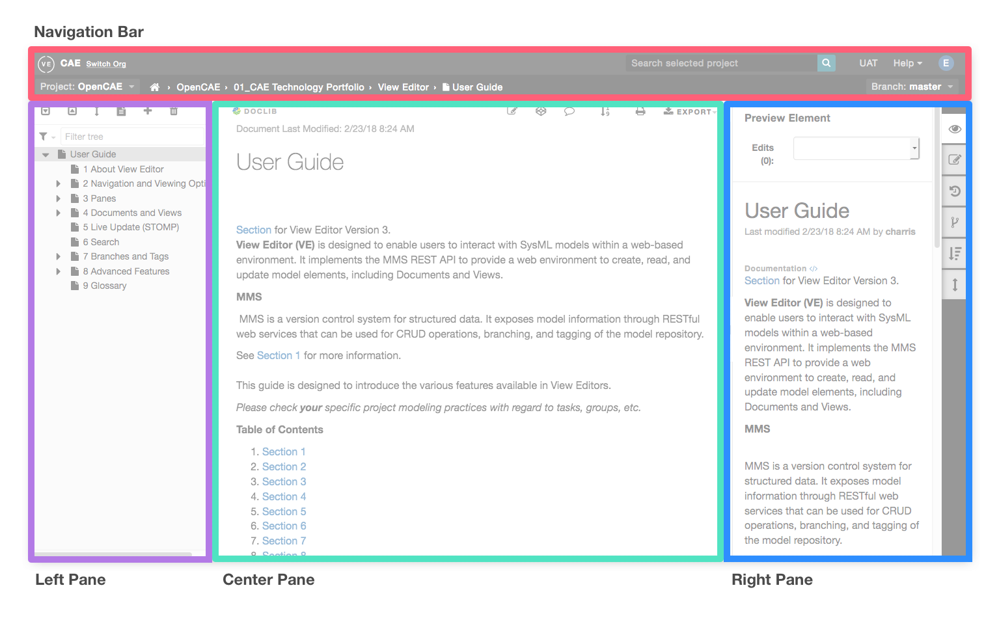

.. include:: images.rst

############
Navigation
############

View Editor is divided into a `navigation bar <#navigation-bar>`__ (red) and a content display area. The content area is divded into three
sections, the `left pane <#left-pane-capabilities>`__ or "tree-view" which displays the tree of the current context. The `center pane <#center-pane-capabilities>`__ shows the current
content and the `right pane <#right-pane-capabilities>`__ hosts a set of tools to further inspect and dive into the model content.

-  `Navigation Bar <#navigation-bar>`__  - Shows
   context of center pane (current project, branch, etc), allows
   management of branches and tags and provides global search and
   helpful links

-  `Left Pane <#left-pane-capabilities>`__ -
   Shows the project/document hierarchies

-  `Center Pane <#center-pane-capabilities>`__
   - Shows Document/View content, provides editing capabilities and
   export options

-  `Right Pane <#right-pane-capabilities>`__ -
   Shows detailed information of the selected element, element history
   and more advanced features of View Editor

===============
Navigation Bar
===============

Top bar
=======

-  Current **org** and option to switch

-  `Search <#search>`__ for current project and
   other mounted projects

-  `Provided External
   Links <#help-and-settings-menus>`__ for View
   Editor resources

Second bar - current context
============================

-  First option on the left displays the **current project** and
   provides quick access to switch between other projects within
   selected Org

-  **Breadcrumbs**, which is the location of the content in the center
   pane   |image9|

-  | **Current branch/tag** and option to switch between other `Tasks
     and
     Tags <#version-control-branches-and-tags>`__
   |  |image10|

===============
Left Pane
===============

The **Left Pane** has the following two display modes:

-  **Groups and Documents** - Displays the hierarchy of groups
   and documents when a project is selected. For more information, refer
   to `Navigate To
   Project <#navigate-to-a-project>`__  and
   `Create/Delete A
   Document <#create-document>`__

-  **Document** - the view hierarchy of the document when a document is
   selected

Below are instructions showing how to use the Left Pane's tools,
specifically while in a document

The instruction includes:
=========================

-  Show/Hide Left Pane

-  Filter

-  Expand All

-  Collapse All

-  View Mode

-  Reorder views

-  View full document

-  Add View

-  Delete View

**Show/Hide Left Pane**

    The Left Pane can be "docked" or "hidden" in the browser.   To
toggle the two states, click on the left pane tab |image11|\ or drag in
and out the pane.

**Filter **\ |image12|

   Filtering the tree allows you to see only the desired views based on
   the *name* of the view or document

   You can then navigate to any of the filtered views. To view the full
   document again, simply delete anything typed in the filter field.
   When this is done, all the views in the document show as if the user
   used the "Expand All" function (see above).

**Expand All **\ |image13|

   Lets you view all the subviews and sections of views within a
   document. The user can then individually collapse views as they
   please.

**Collapse All **\ |image14|

   Lets you collapse all views so that no views are visible in the Left
   Pane. You can then individually expand views level by level as they
   please.

**Filter by type** |image15|

   To filter by different element types, select the filter icon and
   choose the element type

   .. image:: media/image32.png
      :width: 3.25017in
      :height: 2.31956in

**Reorder views**\ |image16|

   You can easily reorder the views in the document, refer to `Reorder
   Views/Elements <#reorder-viewselements>`__.

**View Full Document **\ |image17|

-  This functionality lets you view an entire document in the center
   pane by "stitching" the views all together

-  You can either scroll down in the center pane or select a view in the
   Left Pane to navigate to a certain part of the document

-  You can edit views when viewing the full document both in the Center
   Pane and the Right Pane

-  Depending on the size of the document/views, it may take some time
   for the document to load.

    Steps:

1. Click "Full Document" |image18|

2. Scroll down slowly through the document to show all content of
   document

3. Edit a section while viewing Full Document

**Add View**\ |image19|

   To add a view to an existing document, refer to `Add
   Views <#add-a-new-view>`__.

**Delete View**\ |image20|

   To delete a view from an existing document, refer to `Delete
   Views <#delete-view>`__.

===========
Right Pane
===========

**The Right Pane** lets you inspect the element that is currently
selected.

Note: The Edit Element option will not appear for users who do not have
the correct permissions. Consult with your project manager to obtain the
correct permissions.

The Right Pane tools are shown on the right and described below
with links to more information.

1. `Preview Element <#preview-element>`__:
   Provides more information about a selected element

2. `Edit and Save
   Elements <#edit-and-save-elements>`__:
   Provides the same editing capabilities as the Center Pane and
   similar, but not quite the same, saving options

3. `Element History <#element-history>`__: Lets
   you inspect an element at different points in time and provides an
   option to compare different versions

4. `Jobs <#jobs>`__: Run a document generation
   job on current document to update any structural content changes from
   the model

5. `Branches/Tags <#branchestags>`__: Provides
   a list of existing tags and branches, their time stamps, and a
   hyperlink to the snapshot of the documents

6. `Reorder
   View <#reorder-viewselements>`__\ **:** A
   user can reorder the Presentation Elements within a View.

Preview Element
================

"Preview Element" tab displays the following information of the selected
element:

-  **Name**

-  **Last Modification** - What date/time and by whom

-  **Documentation** - rendered element documentation.\ ** **\ clicking
   on the '</>' icon next to DOCUMENTATION header will toggle the
   display to show raw html

-  **Metatype** - implicitly applied class/stereotype

-  **Location** - where the actual element is stored in the associated
   model in terms of package hierarchy

-  **ID** - the unique element ID. If it begins with "MMS", then it's a
   View Editor created element. If it begins with anything else (usually
   "18_0\_..."), it was created in the MagicDraw model

-  **Branch/Tag** - The name of the Version (Branch/Tag) that the
   selected element is currently being viewed on

You may also see element specific information (e.g. value of the
properties), depending on the type of element.

Edit and Save Elements
=======================

Users can edit elements (refer to `Add Presentation
Elements <#add-presentation-elements>`__)
directly from the right pane by selecting an element in the center pane
and selecting the **Edit Element** button. It also provides a **Save
All ** |image21| option to easily save all current changes. Both the
**Preview Element** and **Edit Element** views show a count and dropdown
of changes in progress that have not been saved.

**Various "Save" options**

1. |image22|  - Saves the changes within the editor and closes the
   editor or opens next change that has not been saved

2. |image23| - Saves changes on the server but the editor remains open
   to continue editing the current element

3. |image24|  - Does a bulk save of all changes in progress

   -  **Multiple Elements - Failed to Save All**

      -  When trying to Save All, the elements may have some conflicts
         that require more attention before saving.

      -  In this case, the you will see the following error

Note: There is an Auto Save plugin that tracks and stores changes in the
browser's local storage  ( See `Autosave to the browser's
localStorage <#autosave-to-the-browsers-localstorage>`__ )

Element History
=========================================

The **Element History tab** has a dropdown with a list of element
versions. Select a version to display its attributes (same as `Preview
Element <#preview-element>`__) at that point in
time.

By default, this tool shows the element at the latest save point.

To visualize the difference between 2 versions, check "Compare Versions"

Branches/Tags
=======================================

**Branches/Tags** can be accessed from the right pane. See `Branches and
Tags <#version-control-branches-and-tags>`__
for more information

=============
Center Pane
=============

The Center Pane lets you edit the view contents.

Exceptions:

1. The **Enable Edits**\ |image25|\ button will not appear for users who
   do not have the correct permissions. Consult with your project to
   obtain the correct permissions for editing.

2. **Cover Pages** currently do not have the ability to export to PDF.

 The Center Pane tools are shown here and described below from left to
right:

-  **Enable Edits** |image27|\ **:** A user can enable edits in order to
   make changes to a view. Refer to `Edit A Presentation
   Element <#edit-a-presentation-element>`__
   for more information. A user must have the collaborator role set in
   Alfresco in order to have access to edit.

-  **Show Comments** |image28| **:** Comments are hidden by default.
   Refer to `Show
   Comments/Elements <#show-commentselements>`__
   for more information.

-  **Export:** Refer to "`Save
   As <#save-as>`__" for more information on
   the following options:

   -  **Print** |image29|\ **:** Print a physical copy of a View or
      Document

   -  **Save to Word** |image30|\ **:** Save a View or Document as a
      local Word Document

   -  **Table to CSV** |image31|\ **:** Save any and all tables found in
      a View or Document as separate CSV files

   -  **HTML to PDF** : |image32| Save a View or Document as a PDF file

-  **Show Elements** |image33|\ **:** Elements borders are hidden by
   default. Refer to `Show
   Comments/Elements <#show-commentselements>`__
   for more information.

-  **Refresh Figure Numbering**\ |image34|: Table, Figure, Equation
   presentation elements and their references in the center pane will be
   updated to include numbering information.

-  **Navigate Views/Sections:** `Navigate Through
   Views <#navigate-within-a-document>`__ for
   the following options:

   -  **Previous**\ |image35|\ **:** Navigate to the previous View

   -  **Next**\ |image36|\ **:** Navigate to the next View

-  **ADD Presentation Elements**

   -  `Add Presentation
      Elements <#add-presentation-elements>`__
      for more information.
