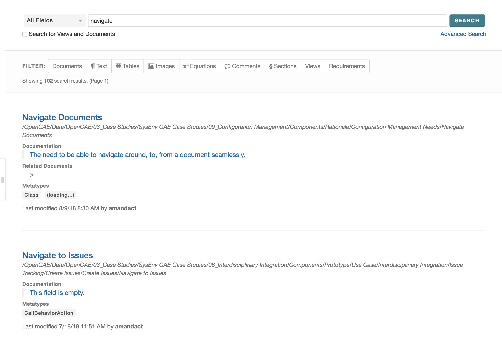
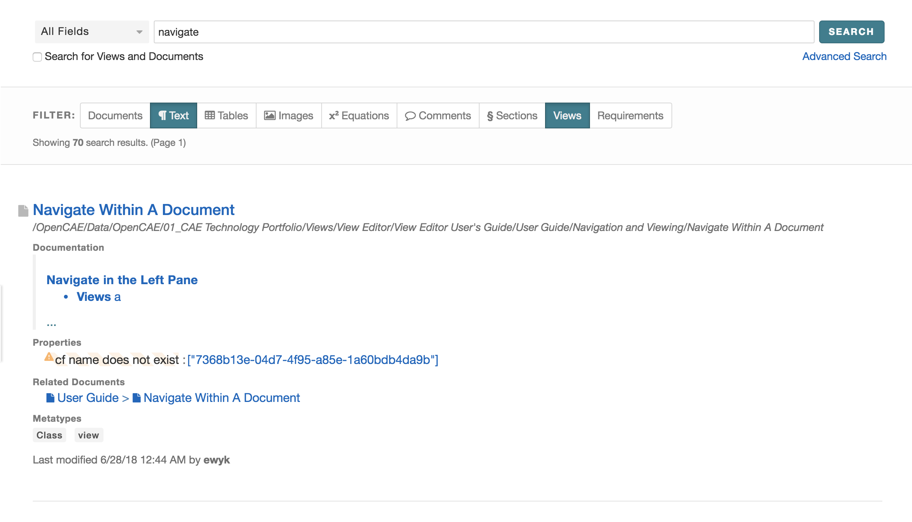

.. include:: images.rst

Search
================================

Global Search
-------------

        View Editor provides the user with the ability to run "global"
searches. It allows searching for elements, views, docs, etc. on
reference branch and its latest tags. The biggest component of the
Search feature it that the user can see the properties of a searched
element. A use can also navigate to the element and the Related
Document. 

Search for an element
---------------------

Enter your search keywords in the search box on top right

            |image69|

All matching search results will appear in the center pane

There are options to Filter the results by Documents,
Views, presentation element types and Requirements.

For more advanced search, click on the "Advanced Search" link below the
"Search" button. You can search against element **Name**,
**Documentation**, **Value**, **ID** or **All** of these using the
operators (And, Or, And Not). Click on "Add Row" to add additional
filters.

        |image70|

**Inside Document Search**

-  When trying to search for a word or sequence of characters in a View,
   the browser's "Find" feature

-  When trying to search for a word or sequence of characters in a
   Document, it is suggested to

   a. View Full Document (Icon in Left Pane, see `Left Pane
      Capabilities <#left-pane-capabilities>`__
      for more information)

   b. Use the browser's "Find" features