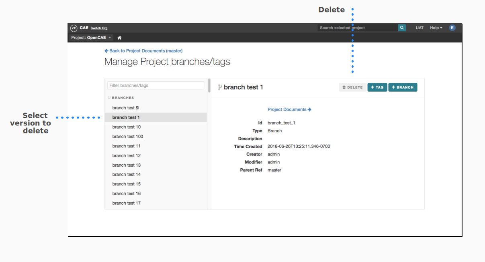

###################
Version Control
###################

**Branches** and **Tags** are used for project version control.

-  A **branch** is an editable copy of a project

-  A **tag** is a read-only snapshot of a project at a certain time

-  For element version documentation, please see `Element
   History <#element-history>`__

Branches
--------

-  From a high level perspective, View Editor branches are similar to
   Git branches.

-  They create a separate workspace built upon a duplication of data at
   a specified time.

-  A branch contains live data; however, the live data is a duplicated
   copy and therefore *any changes made in the Branch do not affect the
   live data in the "master" branch*

-  Branches are configured to be able to sync with Teamwork Branches of
   the same name. Refer to Branch Syncing for more information

Tags
----

-  View Editor Tags are "snapshots" of all the data on a View Editor
   project at specified times.

-  They are read-only

-  This offers users a chance to freeze data at specific and relevant
   times, including reviews and releases

Navigate and View Options
---------------------------------------------------

Please see `Branches/Tags <#branchestags>`__
for instructions on how to navigate to branches and tags

Create/Delete Branches and Tags
---------------------------------------------------------

A user can create Branches and Tags from the Manage Branches/Tags Page.
From there, a user can inspect, add or delete branches. **Master**
branch can not be deleted

Create Branch
~~~~~~~~~~~~~~~~~~~~~~~~~~~~~~~~~~~~~~~

#. Click on "Manage Branches/Tags" button from the Branch/Tag dropdown
   menu on top right.**

#. In Manage Branches/Tags view, select the version to branch off of
   and click the "+BRANCH" button:

#. Follow the dialogue:

1. Name of the branch is required.

2. Set permissions by selecting from the options provided - "Read" or
   "Write"

   a. By default, the user who created the branch will be able to edit
      no matter what option is chosen.

   b. Creating a "Read" branch means that *only* the creator and those
      who are granted specific permissions can edit that branch.

   c. "Write" enables all users the ability to edit the branch

Create Tag
~~~~~~~~~~~~~~~~~~~~~~~~~~~~~~~~~~~~

1. Tags can be created the same way as branches (see `Create
   Branch <#create-branch>`__)

2. Upon creation, the user can choose what timestamp the tag should
   reflect, either "Now" or "Specified

   a. By default, "Now" is selected and the timestamp of "Now" is shown

   b. If a user chooses "Specified", then the user has to manually enter
      a time for the Tag to be taken.

   c. The user can specify year, hour, and minute - although there are
      decimal numbers shown by default, a user should delete these
      values since new ones will be generated upon Tag creation

Delete Branch/Tag
~~~~~~~~~~~~~~~~~~~~~~~~~~~~~~~~~~~~~~~~~~~

#. In Manage Branches/Tags view, select the branch/tag you wish to
delete**

#. Click "Delete" Button**

Once deleted, the branches/tags can no longer be accessed

Branch Syncing
----------------------------------------

**Note:** This applies to Teamwork Cloud (TWC) projects, but not local
projects as the latter do not have branching.

Both TWC and MMS support branching as a part of their version control
functionality. MDK syncs branches created in TWC by committing them to
MMS. To validate the branches on both sides, select "MMS" from the main
menu > "Validate" > "Branches". Validation rule violations will be
presented if they are not in sync, and resolutions can be selected by
right clicking each violation.

